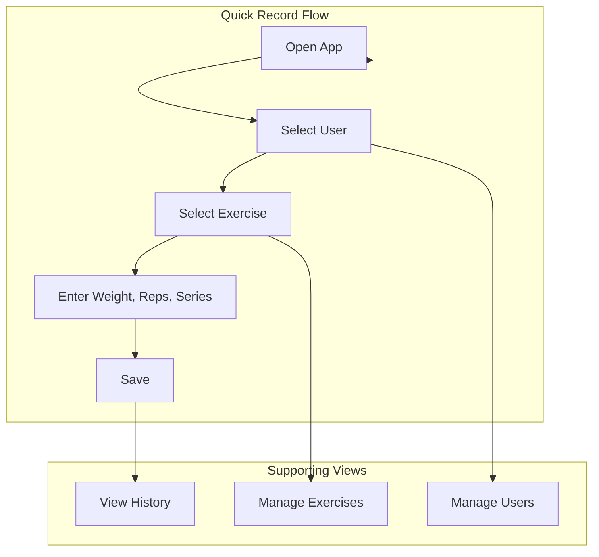

# Top Weight — iOS 26 Fitness Recording App

A fast, eye-catching iOS 26 app for recording exercise details (weights, repetitions, series) with minimal friction. Targets iPhone 16e, uses SwiftUI 6 with Liquid Glass, and SwiftData for persistence.

## Project Context

- **Starting point:** This repository
- **Target:** iOS 26, iPhone 16e (6.1" Super Retina XDR OLED display)
- **Stack:** Swift 6, SwiftUI 6, SwiftData, Xcode 26
- **Design baseline:** Liquid Glass (`.glassEffect()`), system fonts, Haptic Touch

---

## Core User Flow

The app is optimized for speed: open → pick user → pick exercise → enter weight/reps/series → save. No long flows or complex configuration.



---

## Data Model (SwiftData)

| Model             | Purpose                                                         |
| ----------------- | --------------------------------------------------------------- |
| **User**          | `id`, `name`, `createdAt`                                       |
| **Exercise**      | `id`, `name`, `createdAt` (e.g. "Zercher Squad", "Bench Press") |
| **WorkoutRecord** | `user`, `exercise`, `weight` (kg/lbs), `reps`, `series`, `date` |

- Use `@Model` macro for all entities
- `#Unique` on `User.name` and `Exercise.name` (or allow duplicates if user prefers)
- Relationships: `WorkoutRecord` → `User`, `WorkoutRecord` → `Exercise`
- Optional: `ExerciseCategory` if you later add grouping (e.g. legs, upper body)

---

## App Architecture

### Single-target Xcode Project

- New Xcode project: iOS App, SwiftUI lifecycle
- Deployment target: iOS 26
- Supported devices: iPhone (portrait-primary)
- Use Swift Package Manager only if needed for shared code

### Project Structure

```
TopWeight/
├── TopWeightApp.swift          # @main, SwiftData container setup
├── Models/
│   ├── User.swift
│   ├── Exercise.swift
│   └── WorkoutRecord.swift
├── Views/
│   ├── MainTabView.swift       # Tab bar (Record | History)
│   ├── RecordView.swift        # Primary quick-record screen
│   ├── HistoryView.swift       # Past records list
│   ├── Components/             # Reusable UI (glass cards, input controls)
│   └── Sheets/
│       ├── UserManagerSheet.swift
│       └── ExerciseManagerSheet.swift
├── ViewModels/
│   └── RecordViewModel.swift  # State for recording flow
└── Persistence/
    └── (SwiftData handled in app entry)
```

---

## Interface Design

### Design Principles

1. **Direct & fast:** Large tap targets, minimal taps (e.g. 4–5 to save a record)
2. **Minimal config:** No mandatory onboarding; users/exercises created on first use
3. **Liquid Glass:** Cards, buttons, and containers use `.glassEffect(.regular)` for consistency
4. **Visual hierarchy:** Clear separation of user, exercise, and numeric inputs via layout and typography

### Main Screens

#### 1. Record View (Primary)

- **Layout:** Vertical stack, single scroll view
- **User:** Horizontal scroll or grid of recent users; tap to select; prominent "+" for new
- **Exercise:** Same pattern for exercises, with "+" to add new
- **Inputs:**
  - Weight: Stepper + text field (default unit: kg, optional lbs in settings)
  - Reps: Stepper + large number display
  - Series: Stepper (e.g. 1–10)
- **Action:** Large "Save" button at bottom (full-width or pill-shaped)
- **Feedback:** Haptic on save; brief success animation (e.g. checkmark or subtle scale)

#### 2. History View

- **Layout:** List grouped by date (e.g. "Today", "Yesterday", "Feb 27")
- **Cells:** User name | Exercise | weight × reps × series (e.g. "25 kg × 25 reps × 2 series")
- **Gestures:** Swipe to delete (optional)
- **Empty state:** Friendly message + CTA to record first workout

#### 3. User / Exercise Management (Sheets)

- Modal sheets from Record view
- List of users/exercises with "+" and delete
- Simple text field for names
- Use `.glassEffect()` on sheet content for consistency

### Liquid Glass Usage

- **Cards:** `.glassEffect(.regular, in: .rect(cornerRadius: 16))`
- **Buttons:** `.glassEffect(.regular, in: .capsule)` for primary actions
- **Lists/cells:** Optional glass background for selected/highlighted state
- **Sheets:** Glass toolbar and content blocks where appropriate

### Typography & Color

- System font (San Francisco)
- Headlines: `.title` / `.title2` for user and exercise
- Numbers: `.largeTitle` for weight/reps/series
- Semantic colors: accent for primary actions, subtle tints for sections
- Dark/light mode: Use `Color.primary`, `Color.secondary`, adaptive colors

### iPhone 16e Layout

- 6.1" display, ~1170×2532 pt logical
- Safe areas and Dynamic Type support
- Adequate padding for reachability

---

## Technical Implementation Notes

### SwiftData Setup

```swift
// TopWeightApp.swift
@main
struct TopWeightApp: App {
    var body: some Scene {
        WindowGroup {
            MainTabView()
        }
        .modelContainer(for: [User.self, Exercise.self, WorkoutRecord.self])
    }
}
```

### Quick-Record Logic

- Default to last-used user and exercise
- Store "last used" in `UserDefaults` or a lightweight SwiftData flag
- Increment steppers by sensible steps (e.g. 2.5 kg for weight, 1 for reps/series)

### Optional iCloud Sync

- Use SwiftData + CloudKit for cross-device sync if needed later
- Not required for initial release

---

## Deployment & UI Validation on iPhone 16e

Deploying to a physical iPhone 16e is the primary way to validate the interface: Liquid Glass, haptics, and layout behave differently than in the simulator.

### Prerequisites

- **Apple ID:** Free or paid Apple Developer account (free is enough for personal device testing)
- **Xcode 26:** With iOS 26 SDK
- **USB connection:** iPhone 16e with a Lightning or USB‑C cable
- **Trust & pairing:** Device unlocked, "Trust This Computer" accepted when prompted

### Deploying from Xcode

1. Connect iPhone 16e via USB
2. Unlock the device and keep it awake
3. In Xcode: **Product → Destination** → select your iPhone 16e (not "Any iOS Device")
4. First run: Xcode will prompt to register the device and create a development provisioning profile (automatic for personal team)
5. **Product → Run** (or ⌘R) to build and install on the device
6. On the device: if "Untrusted Developer" appears, go to **Settings → General → VPN & Device Management** and trust your developer certificate

### UI Validation Workflow

- **Early deployment:** Run on the device as soon as Phase 2 (Record Flow) is usable; do not wait for Phase 4
- **What to check on device:**
  - Liquid Glass reflections and motion on a real display
  - Touch targets and spacing for one-handed use
  - Haptic feedback strength and timing
  - Readability in bright and dim light
  - Performance of SwiftData and UI on real hardware
- **Iteration:** Build → deploy → test → adjust layout/typography/feedback → repeat

### Troubleshooting

- **"Unable to install":** Ensure iOS version on the device is 26 or newer
- **Provisioning errors:** In **Signing & Capabilities**, select your Team and let Xcode manage signing
- **Device not listed:** Reconnect the cable, restart Xcode, or use **Window → Devices and Simulators** to verify the device

---

## Phased Implementation

### Phase 1: Foundation

- Create Xcode project with iOS 26 target
- Implement SwiftData models (User, Exercise, WorkoutRecord)
- Basic app entry and `ModelContainer` setup

### Phase 2: Record Flow

- Build Record view with user and exercise selection
- Add weight/reps/series input controls
- Implement save logic and basic validation
- **Deploy to iPhone 16e** and validate the record flow on device

### Phase 3: History & Management

- History list with date grouping
- User and exercise management sheets
- Delete and edit where applicable

### Phase 4: Polish

- Apply Liquid Glass throughout
- Haptics and micro-animations
- Empty states, error handling
- Accessibility (VoiceOver, Dynamic Type)
- **Final deploy to iPhone 16e** to validate visuals and interactions on real hardware

---

## Out of Scope (Initial Release)

- Workout templates or predefined programs
- Charts/graphs
- Social or sharing features
- Apple Watch or other device apps
- Multiple weight units (stick to kg first; add lbs later if desired)

---

## Success Criteria

- Record a workout (user + exercise + weight + reps + series) in under 10 seconds
- Zero mandatory configuration before first record
- Consistent Liquid Glass look and smooth interactions
- SwiftData persistence with no data loss across launches
